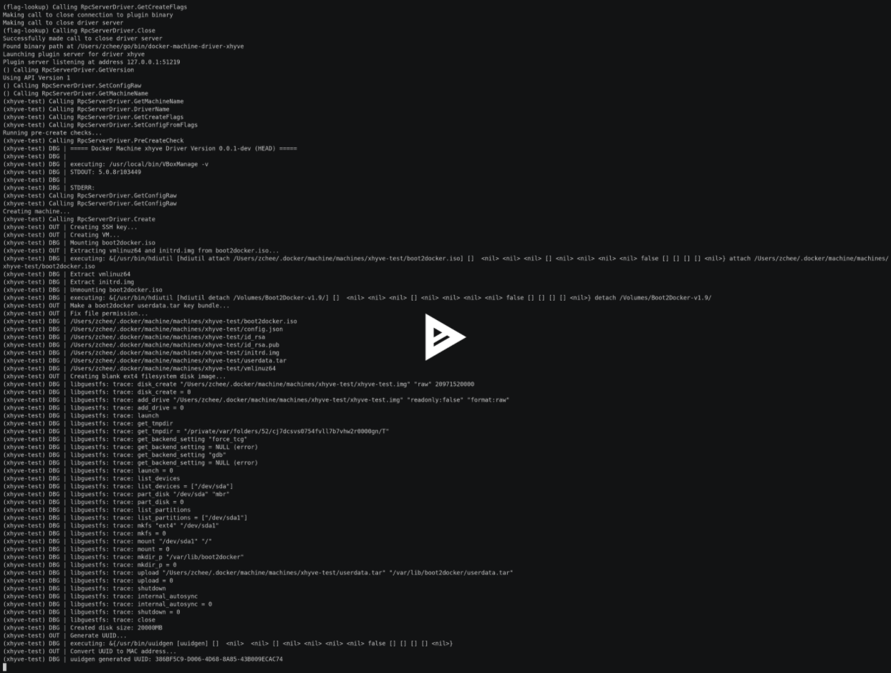

docker-machine-driver-xhyve
===========================

| Releases                                                                                                                                                             | Travis-CI                                                                                                                                             | CircleCI                                                                                                                                                                   |
|:--------------------------------------------------------------------------------------------------------------------------------------------------------------------:|:-----------------------------------------------------------------------------------------------------------------------------------------------------:|:--------------------------------------------------------------------------------------------------------------------------------------------------------------------------:|
| [](https://github.com/zchee/docker-machine-driver-xhyve/releases) | [](https://travis-ci.org/zchee/docker-machine-driver-xhyve) | [](https://circleci.com/gh/zchee/docker-machine-driver-xhyve/tree/master) |

libmachine driver plugin for [xhyve](https://github.com/mist64/xhyve) native OS X Hypervisor

Master branch inherited from [nathanleclaire/docker-machine-xhyve](https://github.com/nathanleclaire/docker-machine-xhyve). Thanks [@nathanleclaire](https://github.com/nathanleclaire) :)  
If you have issues or pull-requests, Desired to be posted to this repository.

Screencast
----------

[](https://asciinema.org/a/29930)

Requirements
------------

### docker-machine or minikube

-	https://github.com/docker/machine
-	https://github.com/kubernetes/minikube

docker-machine-driver-xhyve using libmachine plugin model.

**Please do not post the issue of this repository to the docker/machine and kubernetes/minikube**  
It will interfere with the development of the docker-machine or minikube.  
If you were doubt problem either, please post to this repository [issues](https://github.com/zchee/docker-machine-driver-xhyve/issues).

-	docker-machine

	-	See https://github.com/docker/machine/releases

-	minikube

	-	See https://github.com/kubernetes/minikube/releases

Install
-------

Use [Homebrew/brew](https://github.com/Homebrew/brew):

```sh
$ brew install docker-machine-driver-xhyve

# docker-machine-driver-xhyve need root owner and uid
$ sudo chown root:wheel $(brew --prefix)/opt/docker-machine-driver-xhyve/bin/docker-machine-driver-xhyve
$ sudo chmod u+s $(brew --prefix)/opt/docker-machine-driver-xhyve/bin/docker-machine-driver-xhyve
```

Use `go` with `make`:  
If you want to support qcow2 disk image format, need install [mirage/ocaml-qcow](https://github.com/mirage/ocaml-qcow). See [docker/hyperkit#building](https://github.com/docker/hyperkit#building).

```sh
# Need Go 1.5 vendoring support
$ export GO15VENDOREXPERIMENT=1

$ go get -u -d github.com/zchee/docker-machine-driver-xhyve
$ cd $GOPATH/src/github.com/zchee/docker-machine-driver-xhyve

# Install qcow-format for qcow2 disk image format
$ brew install opam libev
$ opam init
$ eval `opam config env`
$ opam install uri qcow-format conf-libev

# Install docker-machine-driver-xhyve binary into /usr/local/bin
$ make install

# docker-machine-driver-xhyve need root owner and uid
$ sudo chown root:wheel /usr/local/bin/docker-machine-driver-xhyve
$ sudo chmod u+s /usr/local/bin/docker-machine-driver-xhyve
```

Usage
-----

### Available flags

| Flag name                        | Environment variable           | Type   | Default                                                                                                                              |
|----------------------------------|--------------------------------|--------|--------------------------------------------------------------------------------------------------------------------------------------|
| `--xhyve-boot2docker-url`        | `XHYVE_BOOT2DOCKER_URL`        | string | `$HOME/.docker/machine/cache/boot2docker.iso`                                                                                        |
| `--xhyve-cpu-count`              | `XHYVE_CPU_COUNT`              | int    | `1`                                                                                                                                  |
| `--xhyve-memory-size`            | `XHYVE_MEMORY_SIZE`            | int    | `1024`                                                                                                                               |
| `--xhyve-disk-size`              | `XHYVE_DISK_SIZE`              | int    | `20000`                                                                                                                              |
| `--xhyve-uuid`                   | `XHYVE_UUID`                   | int    | `''`                                                                                                                                 |
| `--xhyve-boot-cmd`               | `XHYVE_BOOT_CMD`               | string | See [AUTOMATED_SCRIPT.md](https://github.com/boot2docker/boot2docker/blob/master/doc/AUTOMATED_SCRIPT.md#extracting-boot-parameters) |
| `--xhyve-boot-kernel`            | `XHYVE_BOOT_KERNEL`            | string | `''`                                                                                                                                 |
| `--xhyve-boot-initrd`            | `XHYVE_BOOT_INITRD`            | string | `''`                                                                                                                                 |
| `--xhyve-qcow2`                  | `XHYVE_QCOW2`                  | bool   | `false`                                                                                                                              |
| `--xhyve-virtio-9p`              | `XHYVE_VIRTIO_9P`              | bool   | `false`                                                                                                                              |
| `--xhyve-experimental-nfs-share` | `XHYVE_EXPERIMENTAL_NFS_SHARE` | bool   | `false`                                                                                                                              |

#### `--xhyve-boot2docker-url`

The URL(Path) of the boot2docker image.  
By default, use cached iso file path.

#### `--xhyve-cpu-count`

Number of CPUs to use the create the VM.  
If set `-1`, use logical CPUs usable by the current process.

#### `--xhyve-memory-size`

Size of memory for the guest.

#### `--xhyve-disk-size`

Size of disk for the guest (MB).

#### `--xhyve-uuid`

The UUID for the machine.  
By default, generate and use ramdom UUID. See [xhyve/uuid.go](https://github.com/zchee/docker-machine-driver-xhyve/blob/master/xhyve/uuid.go)

#### `--xhyve-boot-cmd`

Booting xhyve kexec commands.  
By default, use  
`loglevel=3 user=docker console=ttyS0 console=tty0 noembed nomodeset norestore waitusb=10 base host=boot2docker`

#### `--xhyve-boot-kernel`

Booting kernel file path.  
By default, will automatically parses the file path using `(vmlinu[xz]|bzImage)[\d]*`.

#### `--xhyve-boot-initrd`

Booting initrd file path.  
By default, will automatically parses the `initrd` contains file path.

#### `--xhyve-qcow2`

Use `qcow2` disk format.  
If you using minikube, `CONFIG_VIRTIO_BLK=y` support is included in minikube-iso as of version v0.0.6.

#### `--xhyve-virtio-9p`

Enable `virtio-9p` folder share.  
If you using docker-machine, `CONFIG_NET_9P=y` support is included in boot2docker as of version v1.10.2.

#### `--xhyve-experimental-nfs-share`

Enable `NFS` folder sharing.

Known isuue
-----------

### Does not clean up the vmnet when remove a VM

Currently, `docker-machine-driver-xhyve` does not clean up the `dhcpd_leases`.  
like,

```sh
# Running xhyve vm. for example, assign 192.168.64.1
$ docker-machine create --driver xhyve xhyve-test
        |
# Send ACPI signal(poweroff) signal over the ssh
$ docker-machine rm xhyve-test
        |
# Re-create xhyve vm, will assign 192.168.64.2
docker-machine create --driver xhyve xhyve-test
```

It will assigned to 192.168.64.**2**. If create another vm, assigned to 192.168.64.**3**.  
But 192.168.64.**1** are not using anyone.

`vmnet.framework` seems to have decide the IP based on below files

-	`/var/db/dhcpd_leases`
-	`/Library/Preferences/SystemConfiguration/com.apple.vmnet.plist`

So, If you want to reset IP database, please remove it manually. but **very risky**.  
Note that `vmnet.framework` shared net address range is `192.168.64.1` ~ `192.168.64.255`. You can make 255 vm.

I will implement the clean-up process after understanding the `vmnet.framework`.

### Can't launch on macOS 10.11.4 build 15E27e

Mac OS X 10.11.4 build `15E27e` has a **Hypervisor.framework bug**.  
This is Apple's bug.  
But, Apple has been fixed build `15E33e`.

If you launch the `docker-machine-driver-xhyve` on build 15E27e, will displayed

```sh
open : no such file or directory
```

and, In original `xhyve`,

```sh
hv_vm_create failed
```

See

-	https://asciinema.org/a/34798 (15E27e)
-	https://asciinema.org/a/34797 (15E33e)

Could you report?
-----------------

I'm very anxious whether other users(except me) are able to launch the xhyve.  
So, if you were able to launch the xhyve use docker-machine-driver-xhyve, Could you post a report to this issue thread?  
https://github.com/zchee/docker-machine-driver-xhyve/issues/18

If macOS launched by the `Vagrant`, can be build, but will not be able to launch the Hypervisor.  
The cause probably because backend vm (Virtualbox, VMWare, parallels...) to hide the CPU infomation.

In the case of VMWare,

```sh
$ system_profiler SPHardwareDataType
system_profiler[458:1817] platformPluginDictionary: Can't get X86PlatformPlugin, return value 0
system_profiler[458:1817] platformPluginDictionary: Can't get X86PlatformPlugin, return value 0
Hardware:

    Hardware Overview:

      Model Name: Mac
      Model Identifier: VMware7,1
      // Where is "Processor Name:" field?
      Processor Speed: 2.19 GHz
      Number of Processors: 1
      Total Number of Cores: 1
      L2 Cache: 256 KB
      L3 Cache: 6 MB
      Memory: 2 GB
      Boot ROM Version: VMW71.00V.0.B64.1505060256
      SMC Version (system): 1.16f8
      Serial Number (system): ************
      Hardware UUID: ********-****-****-****-************

$ git clone https://github.com/mist64/xhyve && cd xhyve
$ make
$ ./xhyverun.sh
vmx_init: processor not supported by Hypervisor.framework
Unable to create VM (-85377018)
```
